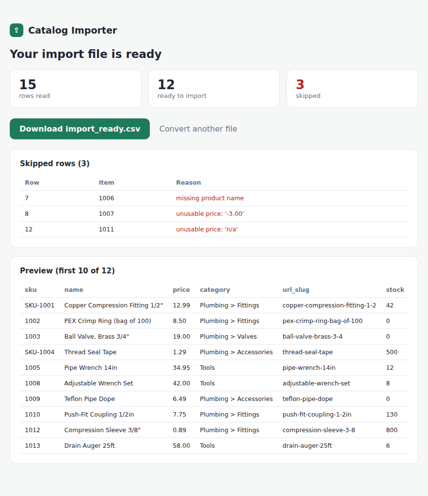

# catalog-importer

**A store owner drops in a messy supplier spreadsheet and gets back a clean import file the platform accepts on the first try.**

E-commerce platforms want product data in an exact format. Supplier exports never come that way. Prices have dollar signs, descriptions have stray HTML, URLs break on a slash, stock is blank, and a few rows are junk. Fixing that by hand for thousands of products is slow and easy to get wrong. catalog-importer does it in one step, and it tells you about every row it had to skip.

It runs on a small sample catalog, so you can try it in a minute.



## What it does

- **Reads almost any supplier export.** Common header names are recognized automatically, so a new file usually works with no setup.
- **Cleans the values.** Prices like `$12.99` and `USD 8.50` become `12.99`. HTML is stripped from descriptions. SKUs are normalized. Categories are tidied.
- **Builds safe product URLs.** Slugs are lowercase, hyphenated, and never start or end with a separator, which is the thing that quietly breaks imports.
- **Fills in defaults.** Blank stock becomes zero, and availability follows from stock.
- **Drops bad rows on purpose.** A row with no name, no SKU, or an unusable price is left out and listed in the report with the reason, so nothing fails silently at import time.
- **Full catalog or sale only.** Import everything, or just the on-sale items.

## Try it

Web tool:

```bash
git clone https://github.com/HenryLabsConsulting/catalog-importer.git
cd catalog-importer
docker compose up
```

Open http://localhost:8090, upload `samples/supplier_products_messy.csv`, and download the result.

Or run it locally without Docker:

```bash
pip install -r requirements.txt
python web/app.py        # http://localhost:8090
```

## Command line

For power users and scheduled jobs, the same engine runs from the terminal:

```bash
python -m importer.cli samples/supplier_products_messy.csv --out import_ready.csv
python -m importer.cli supplier.csv --mode sale --out sale_import.csv
```

It prints a summary and lists every skipped row and why:

```
Read 15 rows, wrote 12 to import_ready.csv.
Dropped 3 rows that could not be imported:
  row 7 (1006): missing product name
  row 8 (1007): unusable price: '-3.00'
  row 12 (1011): unusable price: 'n/a'
```

## Adapting it to your platform

The target columns and the header aliases live in `importer/mapping.py`. Change the column list to match your platform's import spec, add any header names your suppliers use, and the rest of the tool follows. The conversion rules live in `importer/convert.py`.

## Layout

```
catalog-importer/
  importer/     conversion engine, slug builder, CLI, and tests
  web/          Flask upload tool (same engine as the CLI)
  samples/      a messy supplier file and its clean output
  docs/         result-screen preview
  Dockerfile  docker-compose.yml
```

## Tests and CI

GitHub Actions runs on every push: ruff lint, unit tests for price parsing, slug safety, and the conversion rules, plus a CLI smoke test on the sample file.

```bash
ruff check importer web
pytest
```

## Data and safety

The sample data is invented. No real product data, no keys, nothing stored. The web tool converts in memory and hands the file straight back.

## License

MIT. See [LICENSE](LICENSE).

---

Built by [HenryLabs Consulting](https://github.com/HenryLabsConsulting). Data and automation engineering: BI, custom apps, and AI systems.
